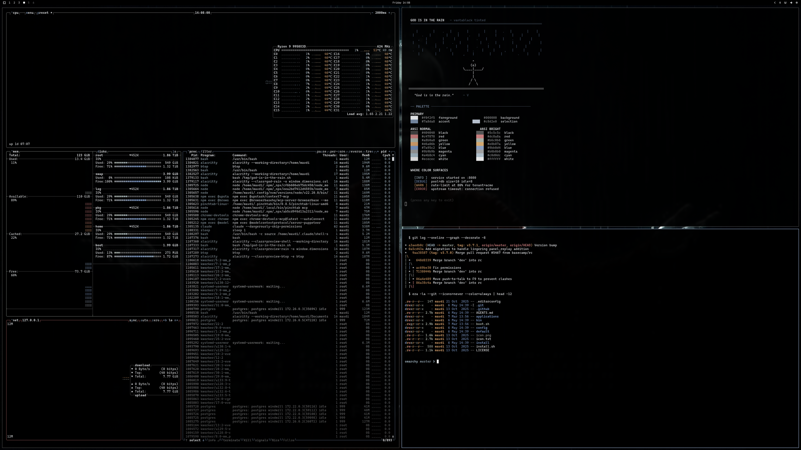
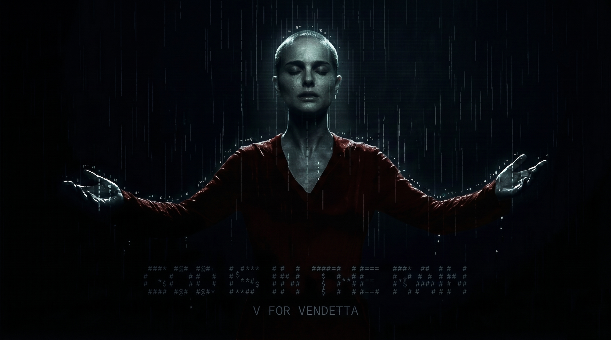

# God Is In The Rain

A high-contrast, near-monochrome theme for [Omarchy](https://github.com/basecamp/omarchy) — a tribute to the rooftop scene in *V for Vendetta*.

Built on the bones of [Vantablack](https://github.com/bjarneo/vantablack.nvim) by [@bjarneo](https://github.com/bjarneo). Pure black background, near-white foreground, with subtle steel-blue, brick-red, and amber accents introduced where Vantablack stays grayscale. Color only surfaces in ANSI output, btop graphs, window borders, and notifications — like rain seen against a streetlamp.

> "God is in the rain." — V



## Installation

```sh
omarchy theme install https://github.com/mavdi/omarchy-god-is-in-the-rain
```

## Wallpaper



## Palette

| Role           | Swatch | Hex |
|----------------|:------:|-----|
| Background     | ⬛ | `#000000` |
| Foreground     | ⬜ | `#f0f2f5` |
| Accent         | 🟦 | `#7a8da8` |
| Selection      | ⬜ | `#c8d2e0` |
| Red            | 🟥 | `#c47878` |
| Orange         | 🟧 | `#d6a06b` |
| Blue           | 🟦 | `#7a95c2` |
| Green          | ⬜ | `#a8b0a8` |
| Cyan           | 🟦 | `#a4b8c4` |

The full palette lives in [`colors.toml`](colors.toml). Btop, terminal, mako, walker, and Hyprland border colors are derived from it via Omarchy's themed templates — so the same six accents propagate through the whole desktop.

## Credits

- Original Vantablack theme by [@bjarneo](https://github.com/bjarneo)
- Wallpaper inspired by *V for Vendetta* (2005)
- Theme by [@mavdi](https://github.com/mavdi)

## License

MIT — see [LICENSE](LICENSE).
